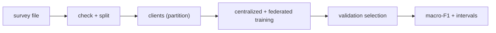
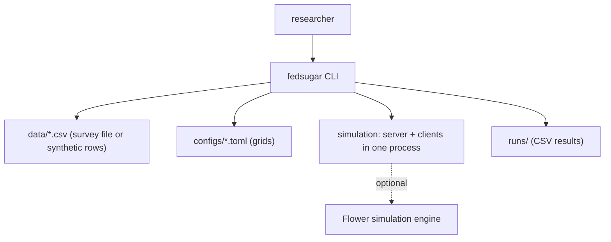
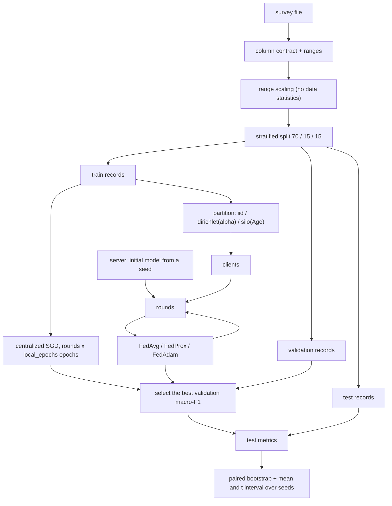

<div align="center">

# fedsugar — Federated Versus Centralized Diabetes Risk Models

**fedsugar is a like-for-like benchmark of federated and centralized training for researchers who study privacy-preserving health models. It takes the 21 BRFSS 2015 indicators through these steps to macro-F1 results with confidence intervals:**

`load and check` → `split` → `partition to clients` → `train centralized and federated` → `select on validation` → `compare over seeds`.


**[Summary](#1-summary)** ·
**[Workflow](#4-the-end-to-end-workflow)** ·
**[Run it](#10-how-to-run-fedsugar)** ·
**[Configuration](#104-environment-variables)** ·
**[Known problems](#13-known-problems)** ·
**[Glossary](#15-glossary)**

</div>

> [!NOTE]
> This README uses ASD-STE100 Simplified Technical English. The writing rules and the project
> vocabulary are in [`docs/ste-style-guide.md`](docs/ste-style-guide.md). Each term in the
> [Glossary](#15-glossary) has only one meaning.

> [!WARNING]
> Do not use fedsugar to diagnose diabetes or to make a treatment decision. It is a research benchmark. The survey answers are self-reported, and the models can be biased for some groups. A clinician must review any health decision.

---

fedsugar trains one model class in two ways. The centralized setting uses all training records at one location. In the federated setting, simulated clients keep their records and send only weights. Both settings use the same model, the same loss, the same class weights, the same optimizer and the same model selection. The main metric is macro-F1, because 84 % of the records are in one class. Times and communication are measured, not estimated with a factor.

This README is the **one location that explains all of fedsugar**. It gives these topics:

- the general design
- each component and its procedure, step by step
- the decision rules
- the data map
- the runbook
- the validation results and the known problems

| If you are… | Read |
|---|---|
| A manager or reviewer | [1](#1-summary), [3](#3-design-rules), [4](#4-the-end-to-end-workflow), [12](#12-validation-results), [14](#14-key-points) |
| A developer who joins the project | All sections, in sequence. Keep [10](#10-how-to-run-fedsugar) and [13](#13-known-problems) open while you work |
| A researcher who runs fedsugar | [10](#10-how-to-run-fedsugar), then the section for the component that you use |

---

## Table of contents

1. 🧭 [Summary](#1-summary)
2. 🏗️ [How fedsugar is built](#2-how-fedsugar-is-built)
   - 2.1 [Components](#21-components)
   - 2.2 [System context](#22-system-context)
   - 2.3 [Repository layout](#23-repository-layout)
3. 🛡️ [Design rules](#3-design-rules)
4. 🔄 [The end-to-end workflow](#4-the-end-to-end-workflow)
   - 4.1 [Full flow](#41-full-flow)
   - 4.2 [The life cycle of one federated round](#42-the-life-cycle-of-one-federated-round)
5. 🔵 [Data, split and partition](#5-data-split-and-partition)
6. 🟢 [Models and centralized training](#6-models-and-centralized-training)
7. 🟣 [Federated training](#7-federated-training)
8. ⚖️ [Metrics, comparison rules and responsible use](#8-metrics-comparison-rules-and-responsible-use)
9. 🗂️ [Data and file map](#9-data-and-file-map)
10. ▶️ [How to run fedsugar](#10-how-to-run-fedsugar)
    - 10.1 [Prerequisites](#101-prerequisites) · 10.2 [Installation](#102-installation) · 10.3 [Run fedsugar](#103-run-fedsugar) · 10.4 [Environment variables](#104-environment-variables)
11. 🧩 [How to extend fedsugar](#11-how-to-extend-fedsugar)
12. ✅ [Validation results](#12-validation-results)
13. ⚠️ [Known problems](#13-known-problems)
14. 📌 [Key points](#14-key-points)
15. 📖 [Glossary](#15-glossary)
16. 📄 [License](#16-license)

---

## 1. Summary

**The problem.** A comparison of federated and centralized training is only valid when the two settings differ in one thing: where the records stay. These are the difficult questions:

- Do both settings use the same model, loss, class weights and model selection?
- Which metric shows the quality on the two small classes, prediabetes and diabetes?
- How long does federated training take, and how many bytes does it send, as a measurement?
- Do the rounds update one shared model, or does each round start again?
- Does the server ever see a record?
- How do the results change with label skew, the number of clients and the seed?

fedsugar gives each of these questions its own component. One configuration object drives both settings.

| Item | Value |
|---|---|
| Input | The BRFSS 2015 survey file (21 indicators, target `Diabetes_012`) or synthetic rows |
| Output | Test metrics for each setting, the federated-minus-centralized macro-F1 with an interval, round histories, grid summaries |
| Components | **6**: data contract, partitioners, NumPy models, centralized trainer, federated simulation, experiment runner |
| Providers | None. An optional adapter runs the same clients with the Flower simulation engine |
| Offline mode | Everything. `fedsugar demo` generates synthetic rows and runs the comparison and a small grid |
| Safety | The server makes the initial model from a seed. A client sends weights, its row count and its label counts, never records |
| Tests | **41** unit tests (`pytest`), 1 skipped without the `flower` extra |



---

## 2. How fedsugar is built

### 2.1 Components

| Component | Module | Purpose |
|---|---|---|
| Settings | `src/fedsugar/config.py` | Read the environment variables |
| Data contract | `src/fedsugar/data.py` | 21 indicators, ranges, range scaling, stratified split |
| Synthetic data | `src/fedsugar/synthetic.py` | Rows with the BRFSS columns and class shares |
| Partitioners | `src/fedsugar/partition.py` | `iid`, `dirichlet`, `silo`, class table, label skew |
| Models | `src/fedsugar/models.py` | Softmax regression, one-layer MLP, class weights, SGD with an optional FedProx term |
| Training | `src/fedsugar/training.py` | `TrainConfig`, centralized trainer, clients, FedAvg, FedProx, FedAdam, clipping and noise |
| Metrics | `src/fedsugar/metrics.py` | Macro-F1, recall per class, ROC-AUC, ECE, paired bootstrap, t intervals |
| Experiments | `src/fedsugar/experiments.py` | One comparison, the TOML grid, summaries |
| Flower adapter (optional) | `src/fedsugar/flower_app.py` | The same clients as Flower `NumPyClient` objects |
| CLI | `src/fedsugar/cli.py` | The `fedsugar` command |

### 2.2 System context



### 2.3 Repository layout

```
fedsugar/
├── src/fedsugar/
│   ├── config.py, data.py        # settings, column contract, split, scaling
│   ├── synthetic.py              # synthetic survey rows
│   ├── partition.py              # iid, dirichlet, silo partitions
│   ├── models.py                 # NumPy softmax regression and MLP, SGD
│   ├── training.py               # centralized and federated training
│   ├── metrics.py                # macro-F1, recall, AUC, ECE, intervals
│   ├── experiments.py            # comparison and TOML grid
│   ├── flower_app.py             # optional Flower adapter
│   └── cli.py                    # fedsugar command
├── configs/                      # sweep.toml (full grid), quick.toml (fast check)
├── tests/                        # 41 pytest tests, synthetic data only
├── data/README.md                # source, license, columns
├── docs/ste-style-guide.md       # writing rules and project vocabulary
├── .github/workflows/ci.yml      # pytest on Python 3.11
└── pyproject.toml                # package, extras, console script
```

---

## 3. Design rules

### 3.1 One configuration for both settings
`training.TrainConfig` holds the model, the learning rate, the batch size, the class weights and the number of rounds. `train_centralized` and `train_federated` read the same object. A test checks that both settings use the same class weights.

### 3.2 Macro-F1 first
`metrics.evaluate` gives macro-F1, balanced accuracy, the recall of each class, ROC-AUC (one-vs-rest), ECE and accuracy. Model selection uses the validation macro-F1. The comparison reports the macro-F1 difference with a bootstrap interval.

### 3.3 Real federated rounds
Each client starts each round from the current global weights and trains `local_epochs` epochs. The server aggregates the updates with FedAvg, FedProx or FedAdam. A test shows that one FedAvg step with full batches equals one centralized gradient step.

### 3.4 A data-free server
`models.make_model` takes the number of features and a seed, not data. `data.scale` uses the documented range of each indicator, so no statistic of the records is needed.

### 3.5 Measured time and bytes
`training.py` measures each client fit and each aggregation with `time.perf_counter`. It reports the sequential time and the parallel time. Communication counts 4 bytes for each parameter, in both directions.

### 3.6 All 21 indicators
`data.FEATURES` holds all 21 indicators. The strongest predictors (`HighBP`, `HighChol`, `GenHlth`, `HeartDiseaseorAttack`, `DiffWalk`) are inputs.

### 3.7 A fixed output size
Each model has 3 outputs. A client without prediabetes records still sends weights of the same shape. A class with no records gets the class weight 0 on that client.

### 3.8 One entry point
The `fedsugar` command runs every step. The grid in `configs/sweep.toml` runs every setting over 5 seeds.

---

## 4. The end-to-end workflow

### 4.1 Full flow



### 4.2 The life cycle of one federated round

1. The server chooses the clients for the round (all clients, or a fraction).
2. The server sends the global weights to each chosen client.
3. Each client copies the weights into a local model.
4. Each client trains `local_epochs` epochs of mini-batch SGD on its own records.
5. Each client sends its update and its row count.
6. If clipping is on, the server clips each update and adds Gaussian noise.
7. The server makes the weighted mean of the updates, with weights `n_k / n`.
8. The server applies the mean update (FedAvg, FedProx) or an Adam step (FedAdam).
9. The server evaluates the new weights on the validation records and keeps the best round.

---

## 5. Data, split and partition

**Purpose.** Load the survey file safely, make one split and give each client its records.

| Input | Output |
|---|---|
| A CSV with the 21 indicators and `Diabetes_012` | Scaled train, validation and test arrays. One index array for each client. A class table |

**Procedure**

1. `data.validate` checks that all 22 columns exist and hold numbers.
2. It checks the range of each column and that binary and ordinal columns hold whole numbers.
3. `data.scale` changes each indicator to 0 to 1 with its documented limits.
4. `data.split` makes a stratified 70 / 15 / 15 split with the seed.
5. `partition.make_partition` assigns the training records to clients.
6. `partition.class_table` shows the records of each class on each client.

**Rules**

- The validation and test records never go to a client. They stay with the evaluator.
- The Dirichlet partition draws again until each client has the minimum number of records.

| Scheme | Rule | Skew |
|---|---|---|
| `iid` | Random equal parts | None |
| `dirichlet` | Class shares per client from Dirichlet(`alpha`) | Label skew. Smaller `alpha` gives more skew |
| `silo` | Quantile bins of one indicator (default `Age`) | Feature skew, for example age groups |

---

## 6. Models and centralized training

**Purpose.** Train one differentiable model on all training records, with the same settings that the clients use.

| Input | Output |
|---|---|
| Train and validation arrays, a `TrainConfig` | The model of the best epoch, test metrics, the history, the measured time |

**Procedure**

1. Make the model from the seed: `logreg` (softmax regression) or `mlp` (one hidden ReLU layer, 32 units).
2. Calculate the class weights `n / (3 n_k)` from the training counts.
3. Train `rounds × local_epochs` epochs of mini-batch SGD on the class-weighted cross-entropy.
4. After each epoch, calculate the validation metrics.
5. Keep the weights of the epoch with the best validation macro-F1.

**Rules**

- The loss is `sum_i w[y_i] (-log p(y_i)) / n + l2 / 2 ||W||^2` with `l2 = 1e-4`.
- The gradients are exact. A test compares them with finite differences.

| Model | Parameters (21 inputs) |
|---|---|
| `logreg` | 66 |
| `mlp` (32 hidden units) | 803 |

---

## 7. Federated training

**Purpose.** Train the same model with clients that keep their records.

| Input | Output |
|---|---|
| Clients, validation and test arrays, a `TrainConfig` | The model of the best round, test metrics, the round history, sequential time, parallel time, communication |

**Procedure**

1. The server makes the initial model from the seed.
2. If `class_weight = global`, each client sends its label counts once. The server calculates the class weights.
3. The server runs the rounds of section 4.2.
4. The server keeps the weights of the round with the best validation macro-F1.

**Rules**

- FedProx adds `mu / 2 ||w - w_global||^2` to the local loss (default `mu = 0.01`).
- FedAdam uses `beta1 = 0.9`, `beta2 = 0.99`, `tau = 1e-3` and `server_lr` (default 0.01).
- The local random generator uses the seed, the round and the client ID, so each round is different.
- Clipping and noise (`--dp-clip`, `--dp-noise`) do not include a privacy accountant. They do not give a formal privacy guarantee.

| Class weighting | Where the weights come from | Like-for-like with centralized |
|---|---|---|
| `global` (default) | Sum of the label counts of all clients | Yes, identical weights |
| `local` | The label counts of each client | No, each client has its own weights |
| `none` | All weights 1 | Yes, with `none` in both |

---

## 8. Metrics, comparison rules and responsible use

| Rule | Value | Code |
|---|---|---|
| Main metric | Macro-F1 over the three classes | `metrics.py` |
| Other metrics | Balanced accuracy, recall of each class, ROC-AUC one-vs-rest, ECE (10 bins), accuracy | `metrics.py` |
| Model selection | Best validation macro-F1 over epochs or rounds | `training.py` |
| Single-split comparison | Paired bootstrap over test records, 1,000 draws, 95 % interval | `metrics.py` |
| Grid comparison | Mean and t interval over seeds of the federated-minus-centralized difference | `experiments.py` |
| Split | 70 % train, 15 % validation, 15 % test, stratified | `data.py` |
| Defaults | 30 rounds, 1 local epoch, learning rate 0.05, batch 64 | `training.py` |
| Communication | 4 bytes for each parameter, server to client and client to server, plus 8 bytes for each label count | `training.py` |
| Parallel time | Sum over rounds of the slowest client time plus the aggregation time | `training.py` |

**Responsible use.**

- fedsugar is not a medical decision tool. Do not use its output for a diagnosis or a treatment.
- The BRFSS answers are self-reported. Undiagnosed diabetes is missing from the labels.
- The model can be less accurate for some age, income or education groups. Check the recall for each group before you publish a result.
- A clinician must review any use of a risk score for a person.
- The simulation does not give a formal privacy guarantee. Real federated use needs secure aggregation and a privacy accountant.

---

## 9. Data and file map

| Path | Committed? | Contents |
|---|---|---|
| `data/README.md` | Yes | Source, license, columns, download steps |
| `data/diabetes_012_health_indicators_BRFSS2015.csv` | No (git ignores it) | The survey file |
| `data/synthetic.csv` | No (git ignores it) | Synthetic rows from `fedsugar synth` |
| `configs/sweep.toml` | Yes | The full grid: 5 seeds, 3 schemes, 4 alphas, 2 client counts, 3 strategies, 2 models |
| `configs/quick.toml` | Yes | A small grid for a fast check |
| `runs/` | No (git ignores it) | `compare.csv`, `history_*.csv`, `runs.csv`, `summary.csv` |
| `.env.example` | Yes | Variable names only |

---

## 10. How to run fedsugar

### 10.1 Prerequisites

| Need | For |
|---|---|
| Python 3.11+ | All components |
| The survey file (see [`data/README.md`](data/README.md)) | Results on real data |
| `flwr` (extra `flower`) | Only the Flower adapter |

### 10.2 Installation

```bash
git clone https://github.com/KrishnaAnnavaram/fedsugar.git
cd fedsugar
python -m venv .venv
. .venv/bin/activate            # Windows: .venv\Scripts\activate
pip install -e ".[dev]"
pip install -e ".[flower]"      # optional: Flower adapter
```

### 10.3 Run fedsugar

Run the offline demo first. It uses synthetic rows only.

```bash
fedsugar demo --out runs/demo
```

Run each step on the survey file.

```bash
fedsugar synth --out data/synthetic.csv --rows 20000
fedsugar partition --scheme dirichlet --alpha 0.5 --clients 5
fedsugar centralized --model logreg --rounds 30
fedsugar federated --model mlp --strategy fedprox --prox-mu 0.01 --alpha 0.1 --clients 10 --history runs/history.csv
fedsugar federated --strategy fedadam --server-lr 0.01 --client-fraction 0.5 --dp-clip 1.0 --dp-noise 0.1
fedsugar compare --scheme dirichlet --alpha 0.5 --clients 5 --out runs/compare
fedsugar sweep --config configs/sweep.toml --out runs/sweep
fedsugar sweep --data data/synthetic.csv --config configs/quick.toml --out runs/quick
pytest -q
```

| Command | What it does |
|---|---|
| `synth` | Writes synthetic rows with the BRFSS columns |
| `partition` | Shows the class table and the label skew of a partition |
| `centralized` | Trains the centralized model and prints the test metrics |
| `federated` | Trains the federated model and prints the metrics, the times and the communication |
| `compare` | Centralized, federated, local-only and gradient boosting on one split, with the paired bootstrap |
| `sweep` | Runs a TOML grid and writes `runs.csv` and `summary.csv` |
| `demo` | Synthetic rows, one comparison, a run without class weights and a small grid |

### 10.4 Environment variables

| Variable | Used by | Meaning |
|---|---|---|
| `FEDSUGAR_DATA` | all training commands | Path of the survey file, default `data/diabetes_012_health_indicators_BRFSS2015.csv` |
| `FEDSUGAR_OUTPUT_DIR` | settings | Output folder, default `runs` |
| `FEDSUGAR_SEED` | `centralized`, `federated`, `compare` | Seed when `--seed` is not given, default `42` |

fedsugar needs no credentials. Keep local settings in a `.env` file. Git ignores this file.

---

## 11. How to extend fedsugar

| You want to… | Do this | Code change? |
|---|---|---|
| Run a new grid | Copy `configs/sweep.toml` and edit the lists | No |
| Add a partition scheme | Add a function to `partition.py` and a name to `SCHEMES` | Small |
| Add a model | Subclass `Model` with `loss_and_grad` and add it to `make_model` | Small |
| Add a strategy (for example FedYogi) | Add a branch to the aggregation step in `train_federated` | Small |
| Use real network clients | Use `flower_app.make_numpy_client` with a Flower server | Small |
| Add a privacy accountant | Track the noise multiplier and the sampling rate per round | Yes |

---

## 12. Validation results

All results below come from `pytest` and from `fedsugar demo`. The demo results use **synthetic data**: 20,000 generated rows with the BRFSS columns. They are not results on the survey.

| Validation | Result | Command |
|---|---|---|
| Unit tests | **41 passed**, 1 skipped (Flower not installed) | `pytest -q` |
| Centralized `logreg`, seed 42 (synthetic) | Macro-F1 0.418, balanced accuracy 0.486, accuracy 0.692, ROC-AUC 0.719 | `fedsugar demo` |
| Federated FedAvg `logreg`, 5 clients, alpha 0.5 (synthetic) | Macro-F1 0.434, balanced accuracy 0.466, accuracy 0.778, ROC-AUC 0.726 | `fedsugar demo` |
| Federated minus centralized macro-F1 (synthetic, one split) | +0.016, 95 % bootstrap interval -0.004 to +0.032 | `fedsugar demo` |
| Local-only mean (synthetic) | Macro-F1 0.396 | `fedsugar demo` |
| Centralized gradient boosting (synthetic) | Macro-F1 0.427 | `fedsugar demo` |
| Measured time, federated (synthetic) | Sequential 0.43 s, parallel 0.14 s, communication 0.053 MB over 20 rounds | `fedsugar demo` |
| No class weights (synthetic) | Accuracy 0.846 but macro-F1 0.402 (centralized) and 0.322 (federated) | `fedsugar demo` |
| Grid, 3 seeds, FedAvg minus centralized macro-F1 (synthetic) | `iid` -0.015 (-0.048 to +0.018). Dirichlet 0.5: -0.036 (-0.182 to +0.109). Dirichlet 0.1: -0.111 (-0.185 to -0.037) | `fedsugar demo` |

The results show the expected pattern on synthetic data. With identical settings and no strong skew, federated and centralized training give a similar macro-F1. Strong label skew (alpha 0.1) lowers the federated macro-F1. The run without class weights shows why accuracy is not the main metric. The prototype reported a higher accuracy for federated training (0.84 against 0.62 to 0.81) and a 91 % time saving. Those are prototype results, not reproduced here. The prototype used different imbalance handling in the two settings and a scaled time.

---

## 13. Known problems

Read these problems before you publish a result of fedsugar.

| # | Area | Problem | Impact and action |
|---|---|---|---|
| 1 | Validation | CI uses synthetic rows. Results on the 253,680 survey records are not reproduced here | Run `fedsugar sweep --config configs/sweep.toml` on the survey file |
| 2 | Prediabetes | The prediabetes class has about 2 % of the records. Its recall stays low in all settings | Report the recall of each class, not only macro-F1 |
| 3 | Simulation | Clients run in one process. The parallel time comes from measured times, but network delays are not included | Use the Flower adapter on real machines for wall-clock results |
| 4 | Privacy | Clipping and noise have no privacy accountant. Label counts go to the server for `global` class weights | Use `class_weight = local` or secure aggregation if counts are sensitive |
| 5 | Models | Only softmax regression and a one-layer MLP. No federated tree model | Gradient boosting is a centralized reference only |
| 6 | Defaults | The default learning rate (0.05) is slow on small clients | Tune `--lr` with the validation records, the same for both settings |
| 7 | Flower | The adapter is not tested in CI (the extra is not installed) | Run the skipped test locally with `pip install -e ".[flower]"` |
| 8 | Bias | No subgroup analysis is included | Add recall by age, sex and income before any health use |

---

## 14. Key points

1. **One configuration drives both settings.** The only difference is where the records stay.
2. **Macro-F1 is the main metric.** Accuracy rewards a model that always predicts "no diabetes".
3. **The rounds are real.** One FedAvg step with full batches equals one centralized gradient step.
4. **The server never sees a record.** The initial model and the scaling need no data.
5. **Time and bytes are measured.** There is no scaling factor.
6. **All 21 indicators are inputs.**
7. **Results come with intervals.** A single split gets a paired bootstrap. A grid gets t intervals over seeds.
8. **Not a medical tool.** Use it for research only.

---

## 15. Glossary

| Term | Meaning |
|---|---|
| **Aggregate** | Make new global weights from the client updates with the strategy |
| **Alpha** | The concentration value of the Dirichlet partition |
| **Centralized model** | The same model trained on all training records at one location |
| **Class** | One target value: `no_diabetes`, `prediabetes` or `diabetes` |
| **Class weights** | The weight of each class in the loss |
| **Client** | A simulated data holder that keeps its records |
| **Communication** | The megabytes that clients and the server send |
| **Federated model** | The model that the server aggregates over the rounds |
| **Grid** | The set of runs in a TOML file |
| **Indicator** | One of the 21 input columns |
| **Label skew** | The mean total-variation distance between the class mix of each client and the global mix |
| **Local epoch** | One pass of a client over its own records in one round |
| **Local-only baseline** | The mean result of models that each client trains alone |
| **Macro-F1** | The mean of the F1 values of the three classes |
| **Parallel time** | The sum over rounds of the slowest client time plus the aggregation time |
| **Partition** | The assignment of training records to clients |
| **Record** | One row of the survey file |
| **Round** | One cycle: send weights, train on clients, aggregate |
| **Sequential time** | The sum of all client times and aggregation times |
| **Server** | The component that makes the initial model and aggregates the updates |
| **Strategy** | The aggregation rule: `fedavg`, `fedprox` or `fedadam` |
| **Synthetic data** | Generated rows. They are not survey records |
| **Target** | The column `Diabetes_012` |
| **Update** | The difference between the client weights after local training and the global weights |
| **Weights** | The parameter arrays of a model |

---

## 16. License

[MIT](LICENSE) © 2026 Krishna Annavaram
